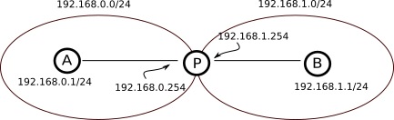

# Administration des réseaux

## Rôle de l'administrateur

**Mettre en place**, **gérer** et **surveiller** le réseau.
Il est **responsable** de *TOUT* ce qui se passe sur ce réseau ou passe par ce réseau.

## Headers des diffèrentes couches

### Couche **transport** (TCP / UDP / ICMP / ARP / ...)

* Port de destination
* Port source

### Couche **réseau** (OSI) ou **accès** (TCP/IP) (IP)

* IP de destination
* IP source
* [TTL](#Time-To-Leave-(TTL))

### Couche **liaison de données** (OSI) ou **accès** (TCP/IP) (IP)

* Adresse MAC de destination
* Adresse MAC source
* [CS](#Checksum-(CS))

> On a pas parlé de **CS** en cours d'admin réseau, demander vérification.

## Time To Live (TTL, hop limit)

Compteur ou timestamp utilisé pour éviter de surcharger le réseau avec des paquets perdus ou mettant trop de temps à arriver. Le champs TTL est vérifié à chaque "saut", c'est à dire au passage de chaque routeur. Dans le cas d'un compteur, il est décrémenté, et s'il est égal à 0, le paquet **peut** être détruit.

## Checksum (CS)

Le checksum permet de vérifier l'intégrité d'une trame. 

> A compléter : il semble exister plusieurs manière de le calculer, ça serait bien de les noter là.

> Demander si CSMACA / CSMACD se basent sur le checksum.

## Routeur

Utilise les 3 premières couches du modèles OSI. La trame remonte à la couche 3, à laquelle on regarde l'IP du destinataire final. A partir de là, on construit une nouvelle trame en mettant en adresse MAC de destination l'adresse MAC du prochain routeur ou du destinataire final, si celui-ci est connecté au routeur.

Quand la nouvelle trame est créée, elle est envoyée par la couche physique. La technologie utilisée peut varier, cela peut être de l'ethernet, du FTH (fibre optique), du HSPA (4G) etc...

Ce système de couche permet de traiter les paquets de manière identique, indépendamment de la technologie employée pour faire naviguer la trame sur le réseau.

> Demander si cette partie vaut aussi pour les switchs (notamment la couche physique).

## Adresse de transport

Adresse représentant l'émetteur d'une trame. Il s'agit du couple :

* IP source
* Port local

## Connexion

"Lien" entre deux applications. Elle est représentée par le 4-uplet :

* IP source
* Port source
* IP destination
* Port destination

> Il y avait une histoire d'implémentation de TCP qui, dans un soucis de performance, n'utilise pas ce tuple pour identifier la connexion. Si quelqu'un s'en souvient et peut compléter...

## TCP

### Header

| Ps  | Pd  | Syn | Fin | Ack | Psh | Urg | Rst | Numéro de séquence | Numéro d'aquitement |
| --- | --- | --- | --- | --- | --- | --- | --- | ------------------ | ------------------- |
|     |     |     |     |     |     |     |     |                    |                     |

Les 6 FLAGS de TCP:

* ACK ( accusé de la reception du paquet )
* SYN (pour synchro)
* FIN (on finit la connexion de manière aimable)
* PSH (bouge toi)
* URG (paquet prioritaire passe devant les autres)
* RST (reset on finit la connexion de manière brutale)

Chaque paquet est numéroté, c'est le **numéro de séquence**.
Le numéro de séquence est aléatoire au départ car sinon on pourrait faire des attaques puisque la connexion est uniquement identifier par le couple **numero de séquence** et **numéro d'aquitement**.

Echange d'un paquet TCP:

<div style="text-align:center">
</div>

> Pour savoir quel est le système d'exploitation en communiquant avec lui, il suffit de regarder la séquence de numéro aléatoire qui est spécifique à chaque système d'exploitation.

> la fenêtre TCP c'est le nombre de paquets/volume de données que j'autorise à envoyer sans recevoir d'aquitement

### Notion de masque

Elle permet de différencier les machines qui font parties d'un réseau des autres, c'est utilisé dans le firewall par exemple.

### Manipulation addresse ip

| Commandes                                | Ancien monde                 | Nouveau monde                                                          |
| ---------------------------------------- | ---------------------------- | ---------------------------------------------------------------------- |
| Lister les interfaces réseaux            | ifconfig -a                  | ip addr show                                                           |
| Attribuer une adresse IP à eth0          | ifconfig ech0 192.168.0.1/24 | ip link eth0 up && ip addr add 192.168.0.1/24 dev eth0 brd +           |
| Attribuer une nouvelle adresse IP à eth0 | ifconfig ech0 192.168.0.1/24 | ip addr del 192.168.0.1/24 dev eth0 brd+ && ip addr 192.168.0.1/24 ... |

### communication entre deux machines

Si on veut communiquer de A à B :
  
  1. soit A est dans le même réseau que B <=> l'adresse de A après application du masque est égal à l'adresse de B après application du masque.
  2. soit A n'est pas dans le même réseau que B

Dans le cas 1, il n'y a plus besoin de passer par la couche réseau.

#### Réseau local

La machine A va regarder dans son **cache ARP** si elle connaît l'adresse MAC de B. Si c'est la cas, alors le packet est envoyé sinon elle va utiliser le protocol Address Resolution Protocol (**ARP**) pour déterminer l'adresse MAC de B.

1. A va demander à tout le monde qui possède l'adresse IP de B ? sur l'adresse de broadcast d'ethernet (FF:FF:FF:FF:FF:FF)
2. B répond par un paquet ARP et enregistre l'adresse MAC de A dans son cache ARP
3. A reçoit et enresgistre l'information dans son cache ARP
4. la communication se déroule ensuite

Il y a un **delais TTL** dans le cache ARP de 30s par défaut avant que se dernier ne soit remis à zéro.

#### Réseaux différents -> routage

Pour connecter des machines dans des réseaux différents on a deux choix :

1. le switch / hub
2. le routeur

**Table de routage** : décrit une passerelle par rapport à un réseau.
La passerelle fait forcement parti de notre réseau local.

Les tables de routage doivent être cohérentes les une avec les autres car elles se découvre de proche en proche.

<div style="text-align:center">
</div>

Table de routage de A et B:

| A                          | B                     |
| -------------------------- | --------------------- |
| default 192.168.0.254      | default 192.168.1.254 |
| 192.168.2.0/24 192.168.0.3 |                       |

Le système d'exploitation ajoute des routes pour les réseaux locaux afin d'uniformiser la gestion des communications entre machines locales et distantes.

exemple : 192.168.0.0/24 dev eth0

Si on enlève une tel route, elle ne peut plus communiquer avec les machines de son réseau.

#### Commandes route

| Commandes            | Ancien monde                       | Nouveau monde                                                  |
| -------------------- | ---------------------------------- | -------------------------------------------------------------- |
| route vers un réseau | route add/del -net @R/masque gw @p | ip route add/del @R/masque via @passerelle dev 'interface' ... |
| route vers hôte      | route add/del -host @host gw @p    |                                                                |
| route par défaut     | route add/del default gw @p        | ip route add/del default via @passerelle dev 'interface' ...   |

Commande utilise:

```bash
ip route get @B ?
```


