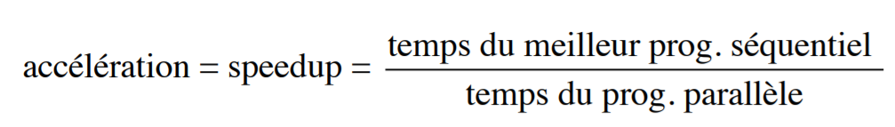
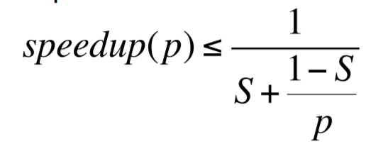

# Programmation des architectures parallèles

## Améliorer les performances en séquentiel

Les performances peuvent être senseiblement améliorées en optimisant le code machine généré ou en utilisant [SIMD](#Simple-Instruction-Multiple-Data-(SIMD)).

## Simple Instruction Multiple Data (SIMD)

> A compléter

## Paralèlisation du code

Certains bouts de code peuvent être exéutés en parallèles. Cependant, le gain de performance va être limité par le code séquentiel, et ce même si le code "parallèle" a une infinité de threads à disposition.

Le gain (accéleration) peut être calculé avec la  [loi d'Amdahl](#Loi-d'Amdahl).

## Loi d'Amdahl

Cette loi permet de calculer **l'accéleration** (speedup) d'un programme parallèle par rapport à son équivalent séquentiel.

accéleration = temps meilleur programme séquentiel / temps meilleur programme parallèle

